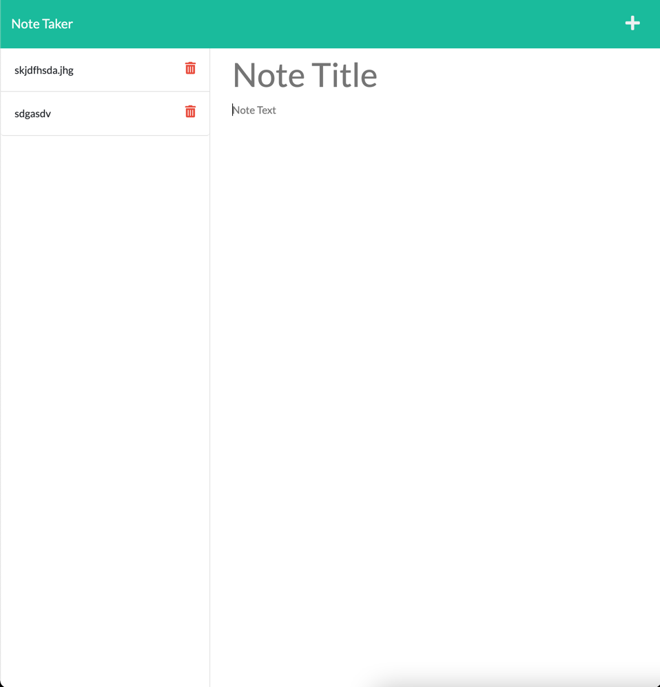

# Note Taker App

## Table of Contents
* [Description](##description)
* [Screenshot](##screenshot)
* [Installation Instructions](##installation)
* [Usage Details](##usage)
* [Contribution Guidelines](##contribution-guidelines)
* [Testing Instructions](##testing-instructions)
* [Questions?](##questions?)
* [License Info](##license)

## Description

An app to allow a user to take notes and save them to a server.
This application is deployed to Heroku @ https://frozen-woodland-95191.herokuapp.com/notes

## Installation

Download and install dependencies, then host on a server of your choice.  This project is also hosted on Heroku

## Usage

As a note taking app

## Contribution Guidelines

Make pull requests or describe issues in Git

## Testing Instructions

Feel free to test accordingly.  No test classes were added 

## Questions?

Check out my Github: http://www.github.com/mkohn4
Email Me: kohn.max@gmail.com

## License
MIT License

        Copyright (c) 2021 mkohn4
        
        Permission is hereby granted, free of charge, to any person obtaining a copy
        of this software and associated documentation files (the "Software"), to deal
        in the Software without restriction, including without limitation the rights
        to use, copy, modify, merge, publish, distribute, sublicense, and/or sell
        copies of the Software, and to permit persons to whom the Software is
        furnished to do so, subject to the following conditions:
        
        The above copyright notice and this permission notice shall be included in all
        copies or substantial portions of the Software.
        
        THE SOFTWARE IS PROVIDED "AS IS", WITHOUT WARRANTY OF ANY KIND, EXPRESS OR
        IMPLIED, INCLUDING BUT NOT LIMITED TO THE WARRANTIES OF MERCHANTABILITY,
        FITNESS FOR A PARTICULAR PURPOSE AND NONINFRINGEMENT. IN NO EVENT SHALL THE
        AUTHORS OR COPYRIGHT HOLDERS BE LIABLE FOR ANY CLAIM, DAMAGES OR OTHER
        LIABILITY, WHETHER IN AN ACTION OF CONTRACT, TORT OR OTHERWISE, ARISING FROM,
        OUT OF OR IN CONNECTION WITH THE SOFTWARE OR THE USE OR OTHER DEALINGS IN THE
        SOFTWARE.

